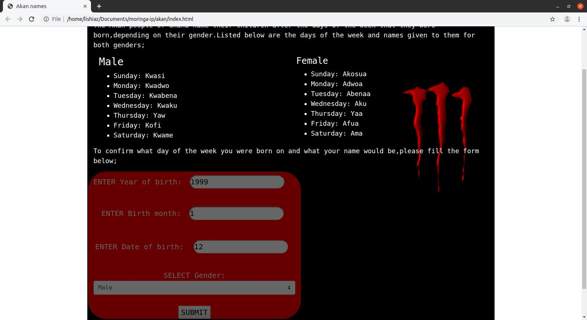

#Akan names

This is a simple program that can tell you what day of the week you were born just by filling in a number of details  i.e year of birth,month of birth and the date of birth then this will automatically calculate what day of the week you were born and also assign you an Akan name because the Akan community actually names children after days of the week they were born

Link below is ascreenshot of how it looks;

##Author

Joseck Osugo-A juniour software developer

##contributors

Joseck Osugo

##installation and setup instructions

First you need to access the github  then add th following link anf fork it (https://github.com/Osugo38/akan.git) to run the project ,no additional  settting are needed just

##BDD
This refer to the inconsistency of the data being reviewed and how it has been cartered for...using the following formulae the leap year has been cartered for:
Day of the week (d) = ( ( (CC/4) -2*CC-1) + ((5*YY/4) ) + ((26*(MM+1)/10)) + DD ) mod 7
where;

CC - is the century digits. For example 1989 has CC = 19

YY - is the Year digits (1989 has YY = 89)

MM -  is the Month

DD - is the Day of the month

mod - is the modulus function ( % )

##Technology used

##contact information
you can email me at josugo38@gmail.com

##license and copyright

This project is licensed under the MIT License and its attached below
--------------------------------
MIT License

Copyright (c) 2019 Osugo38

Permission is hereby granted, free of charge, to any person obtaining a copy
of this software and associated documentation files (the "Software"), to deal
in the Software without restriction, including without limitation the rights
to use, copy, modify, merge, publish, distribute, sublicense, and/or sell
copies of the Software, and to permit persons to whom the Software is
furnished to do so, subject to the following conditions:

The above copyright notice and this permission notice shall be included in all
copies or substantial portions of the Software.

THE SOFTWARE IS PROVIDED "AS IS", WITHOUT WARRANTY OF ANY KIND, EXPRESS OR
IMPLIED, INCLUDING BUT NOT LIMITED TO THE WARRANTIES OF MERCHANTABILITY,
FITNESS FOR A PARTICULAR PURPOSE AND NONINFRINGEMENT. IN NO EVENT SHALL THE
AUTHORS OR COPYRIGHT HOLDERS BE LIABLE FOR ANY CLAIM, DAMAGES OR OTHER
LIABILITY, WHETHER IN AN ACTION OF CONTRACT, TORT OR OTHERWISE, ARISING FROM,
OUT OF OR IN CONNECTION WITH THE SOFTWARE OR THE USE OR OTHER DEALINGS IN THE
SOFTWARE.
